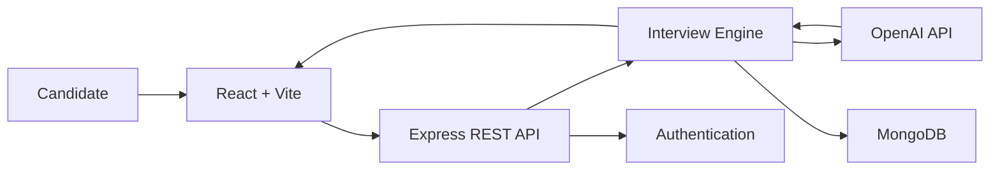
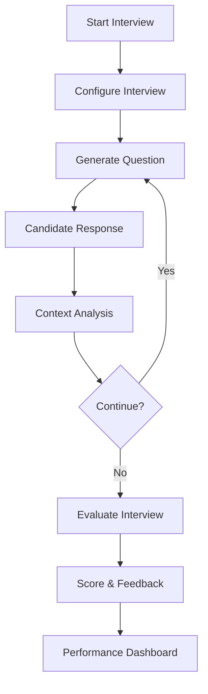

# InterviewX — AI-Powered Real-Time Interview Platform

<p align="center">
  <strong>Practice interviews with AI. Get evaluated. Track your improvement.</strong>
</p>

<p align="center">
  
  
  
  
  
  
</p>

---

## 🚀 Overview

**InterviewX** is a full-stack AI interview platform designed to simulate realistic technical and behavioral interviews.

It combines **LLM-powered interview orchestration, dynamic questioning, voice/text interaction, response evaluation, scoring, and structured feedback** into a single interview workflow.

---

## ✨ Features

* 🤖 AI-powered technical & behavioral interviews
* 🧠 Dynamic and context-aware question generation
* 🔄 Adaptive follow-up questions
* 🎙️ Voice + text interaction
* 📝 Speech-to-text processing
* 📊 AI-based candidate evaluation & scoring
* 💬 Structured interview feedback
* 📈 Interview performance tracking
* 🔐 Authentication and protected sessions
* 💾 Interview and feedback persistence

---

## 🏗️ Architecture



---

## 🔄 Interview Workflow



---

## 📊 Evaluation Model

```text
                Interview Performance
                         │
       ┌─────────────────┼─────────────────┐
       ▼                 ▼                 ▼
 Technical           Problem           Communication
 Knowledge           Solving
       │                 │                 │
       └─────────────────┼─────────────────┘
                         ▼
                  Overall Evaluation
                         │
                         ▼
                  Feedback Report
```

---

## 🛠️ Tech Stack

| Layer    | Technologies                        |
| -------- | ----------------------------------- |
| Frontend | React 18, Vite, React Router, Axios |
| Backend  | Node.js, Express.js                 |
| Database | MongoDB, Mongoose                   |
| AI       | OpenAI API                          |
| Voice    | Speech-to-Text / Whisper            |
| Auth     | JWT                                 |
| Styling  | Custom CSS                          |

---

## 📂 Project Structure

```text
InterviewX/
├── frontend/
│   └── src/
│       ├── components/
│       ├── pages/
│       ├── services/
│       ├── hooks/
│       └── utils/
│
├── backend/
│   ├── controllers/
│   ├── models/
│   ├── routes/
│   ├── middleware/
│   ├── services/
│   └── config/
│
└── README.md
```

---

## ⚡ Getting Started

```bash
git clone https://github.com/YOUR_USERNAME/interviewx.git
cd interviewx

# Frontend
cd frontend
npm install
npm run dev

# Backend
cd ../backend
npm install
npm run dev
```

Create a `.env` file in the backend:

```env
PORT=5000
MONGODB_URI=your_mongodb_uri
JWT_SECRET=your_jwt_secret
OPENAI_API_KEY=your_openai_api_key
```

---

## 🛣️ Roadmap

* [x] Interview UI
* [x] AI interaction foundation
* [x] Feedback interface
* [ ] Complete AI interview orchestration
* [ ] Adaptive questioning
* [ ] Voice interview mode
* [ ] Persistent interview history
* [ ] Performance analytics
* [ ] Production deployment

---

## 🎯 Core Pipeline

```text
Configure
   ↓
Interview
   ↓
Response
   ↓
AI Analysis
   ↓
Evaluation
   ↓
Feedback
   ↓
Performance Tracking
```

---

## 📜 License

Educational and portfolio project.

<p align="center">
  <strong>InterviewX — Practice Smarter. Interview Better.</strong>
</p>
